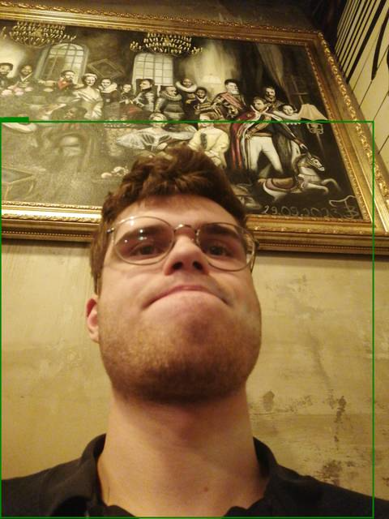

# CameraHome 📸
**Autonomous Edge Vision Surveillance for Android (Termux)**

An AI-powered security system that runs entirely on your Android phone via Termux. It uses **YOLOv8** to detect people in real-time and sends alerts with annotated photos to **Telegram** and **Home Assistant (via MQTT)**.

---

## ✨ Features
- 🚀 **Edge AI**: Runs YOLOv8n (TFLite) locally on mobile hardware.
- 📱 **Termux Integration**: Native camera control via Termux-API.
- 🤖 **Smart Detection**: Specifically tuned for person detection to avoid false alarms.
- 🎨 **Visual Alerts**: Draws bold green bounding boxes and confidence scores directly on photos.
- 💬 **Telegram Notifications**: Snapshot delivery with caption to your private bot.
- 🏠 **Home Assistant Ready**: Publishes detection events to MQTT.

---

## 🛠️ Requirements

### 1. Android Apps
- **[Termux](https://f-droid.org/en/packages/com.termux/)** (F-Droid version only)
- **[Termux:API](https://f-droid.org/en/packages/com.termux.api/)** (Required for camera access)

### 2. Termux Setup
Run these commands inside Termux:
```bash
pkg upgrade
pkg install termux-api python opencv-python
```

### 3. Python Dependencies
```bash
pip install numpy paho-mqtt requests pillow tflite-runtime
```

---

## ⚙️ Configuration

Create a `.env` file in the project root:

```env
TELEGRAM_TOKEN=your_bot_token
TELEGRAM_CHAT_ID=your_chat_id
MQTT_HOST=your_broker_ip
THRESHOLD=0.6
COOLDOWN=30
CAMERA_ID=0
MODEL_PATH=yolov8n_float16.tflite
```

---

## 🚀 Usage

Start the monitoring system:
```bash
python vision_mqtt.py
```

### Advanced Options:
| Flag | Description | Default |
|------|-------------|---------|
| `--threshold` | Detection confidence level | 0.6 |
| `--cooldown` | Seconds between notifications | 30 |
| `--camera` | Camera ID (0: back, 1: front) | 0 |
| `--model` | Path to your `.tflite` model | yolov8n_float16.tflite |

---

## ⚖️ Security Note
This project uses environment variables (`.env`) for credentials. **Never** commit your `.env` file to public repositories.

---
**Developed by [IGORSVOLOHOVS](https://github.com/IGORSVOLOHOVS)**
